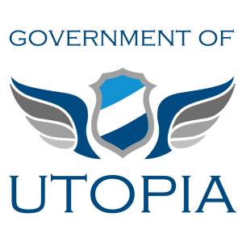

# Utopia

> Resources for the fictitious country of Utopia.

## Table of Contents

- [Background](#background)
- [Usage](#usage)
- [Contribute](#contribute)
- [Commercial Support](#commercial-support)
- [License](#license)

## Background

Resources here are used for various tests and demos often centered around
[Verifiable Credentials][] and related technologies. They are used for tests
and examples of how technologies could work with organizations, states,
countries, and similar. This is all for an example fictitious country and
government.

Utopia's current benevolent dictator for life is [Digital Bazaar, Inc.][].

## Usage

See the source for all available resources:
https://github.com/digitalbazaar/utopia

**NOTE**: These resources might not be stable! If you need to depend on stable
resources, first discuss the matter with the maintainers here for options, or
fork and maintain your own resources.

### Contexts

- Utopia context
  - [source](./contexts/utopia-v1.jsonld)
  - URL: https://w3id.org/utopia/v1
- Utopia citizenship context
  - [source](./contexts/utopia-citizenship-v1.jsonld)
  - URL: https://w3id.org/utopia/citizenship/v1
  - Temporary alt URL: https://w3id.org/citizenship/utopia/v1

### Images

- Utopia images
  - [source](./images)

## Contribute

Issues and PRs are welcome:
https://github.com/digitalbazaar/utopia

## Commercial Support

Commercial support for this project is available upon request from
Digital Bazaar: support@digitalbazaar.com

## License

[BSD-3-Clause](LICENSE.md) © Digital Bazaar, Inc.

[Digital Bazaar, Inc.]: https://digitalbazaar.com/
[Verifiable Credentials]: https://www.w3.org/2017/vc/WG/
